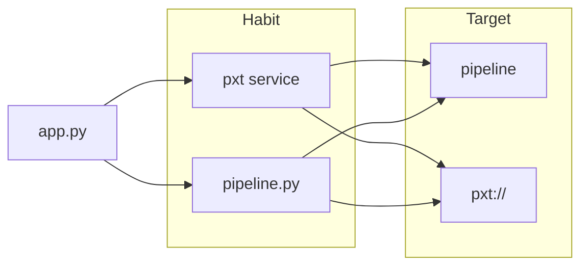

# Pixeltable Starter Kit

One application file (`app.py`). `pxt schema update` creates the tables.
`pxt service update` starts HTTP from the same file.

## First run

1. Scaffold.

   ```bash
   uvx pixeltable-new myapp
   cd myapp && uv sync
   ```

2. Apply, then serve.

   ```bash
   pxt schema update app.py pipeline
   pxt service update app.py pipeline
   ```

   `pxt schema update` creates the catalog directory and tables. It does not start HTTP.
   `pxt service update` does not create tables. Apply first.

3. Insert a row. `pxt service list` prints the URL (the port is assigned):

   ```bash
   pxt service list
   # pipeline  http://127.0.0.1:<port>  ...
   curl -X POST http://127.0.0.1:<port>/api/ingest/document \
     -H 'Content-Type: application/json' \
     -d '{"title": "Hello", "body": "One application file. Insert runs compute.", "source_id": "api-001"}'
   ```

The scaffold wrote this (excerpt):

```python
class Documents(TableModel, name="documents"):
    title: pxt.String
    body: pxt.String
    source_id: pxt.String
    uuid = pxt.Column(value=pxtf.uuid.uuid7(), primary_key=True)


api = FastAPIRouter(name="pipeline", prefix="/api")
api.add_insert_route(
    Documents,
    path="/ingest/document",
    inputs=[Documents.title, Documents.body, Documents.source_id],
    outputs=[Documents.uuid],
)
```

On disk vs in the catalog. `pipeline` is a catalog directory, not a folder next to `app.py`.

```
myapp/
  pixeltable.toml
  app.py
  pyproject.toml
```

```
pipeline/
  documents
  sentences
  images
```

`pixeltable.toml` is the project root. The scaffold writes it. If you copied files by hand, run `pxt init` first.

Python 3.11+. `uv sync` pulls Pixeltable from GitHub. PyPI 0.7.2 cannot resolve `.similarity` on a model column.

## Next

Two forks. Same `app.py`.



**Habit** (what `uvx` copies):

- Default is [`serving/`](serving/): `pxt service` starts HTTP.
- No HTTP: `uvx pixeltable-new myapp --batch`, then [`batch/`](batch/).
- Already have FastAPI: apply the file, then `app.include_router(api)` on the router in `app.py`. Not a `uvx` flag.

**Target** (CLI argument to `pxt schema update`):

- This machine: `pipeline` (the first run).
- Hosted catalog: `pxt schema update app.py pxt://org:mydb`. `pxt service` stays local. Browse and insert: dashboard and Cloud recipes. [`serving/deploy/pixeltable-cloud/`](serving/deploy/pixeltable-cloud/) · [Cloud](https://docs.pixeltable.com/howto/deployment/cloud).

**Extra DAGs** (not copied by `uvx`):

- An agent with the [Pixeltable skill](https://github.com/pixeltable/pixeltable-skill) writes tables into `app.py`.
- Video frames and an agent-as-table: [`examples/`](examples/). Cloud recipes: [`gallery.json`](gallery.json).

## For agents

Emit `TableModel` classes and a `FastAPIRouter` in `app.py`. Indexes go on `__indexes__`.
Run `pxt schema diff app.py pipeline`. Exit 0 means in sync. Exit 2 means pending (`--json` is the plan).
Exit 1 is an error that names the file, declaration, or key. Then `pxt schema update`.
Do not emit a sequence of table-create or column-add calls. Destructive ops need `--allow-destructive`.

Layout, how to extend serving, and tests: [AGENTS.md](AGENTS.md).
Skill: `npx skills add pixeltable/pixeltable-skill`.

## Resources

- [Quickstart](https://docs.pixeltable.com/overview/quick-start) · [How it works](https://docs.pixeltable.com/overview/how-it-works)
- [Self-hosting](https://docs.pixeltable.com/howto/deployment/overview) · [Cloud](https://docs.pixeltable.com/howto/deployment/cloud) · [HTTP serving](https://docs.pixeltable.com/howto/deployment/serving)
- [pixeltable-new](https://github.com/pixeltable/pixeltable-new) · [pixeltable-skill](https://github.com/pixeltable/pixeltable-skill)

## License

Apache 2.0
