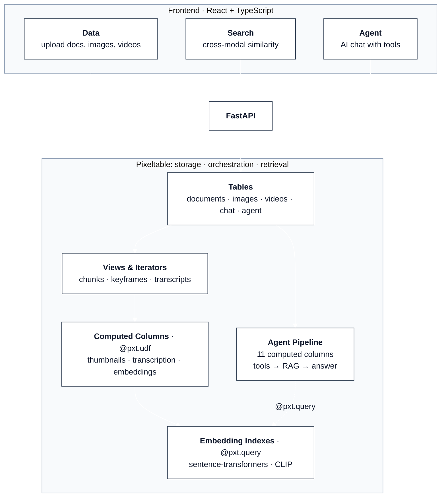
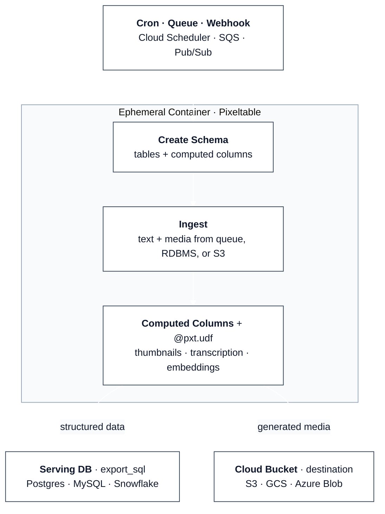

# Pixeltable Starter Kit

[Pixeltable](https://github.com/pixeltable/pixeltable) is **open-source data infrastructure for AI**. It replaces the patchwork of blob storage, metadata DBs, vector stores, media processing, orchestration, and glue code with a single declarative system. Tables, computed columns, and embedding indexes handle what typically requires stitching together S3, Postgres, Pinecone, FFmpeg, HuggingFace, Airflow, LangChain, and custom scripts to wire them all together.

This starter kit demonstrates **three ways to integrate Pixeltable** into your stack, plus seven ready-to-scaffold application templates. Tested against **Pixeltable 0.6.5** (`pixeltable>=0.6.5`). Python 3.11+. An application's contract is an `app.py` (`TableModel` + `FastAPIRouter`). Apply with `pxt schema update`, serve locally with `pxt service`. A project root is a directory with `pixeltable.toml` (or `pyproject.toml` with `[tool.pixeltable]`). `pxt init` writes one.

> **Fastest path:** `uvx pixeltable-new --template full-stack-showcase myapp` → `cd myapp && uv sync && python app.py`

## Three ways to use Pixeltable

Pick the integration mode that matches your workload:

| Question | Pattern | Folder |
|---|---|---|
| I need a custom API (with optional UI) | **API Backend**: FastAPI + Pixeltable | [`backend/`](backend/) |
| I need batch/background processing (cron, queue, Cloud Run Job) | **Batch Processing**: pure Python script, no HTTP server | [`batch/`](batch/) |
| I want an API with zero web code | **Declarative Serving**: `app.py` + `pxt service` | [`serving/`](serving/) |

Pixeltable itself is not an HTTP framework: it's a **data engine**. The starter kit wraps it in FastAPI where a demo UI is useful, but **if your workload is batch processing, you don't need FastAPI at all**. `batch/` is a plain Python script that inserts data, lets computed columns process it, exports results, and exits.

### Project structure

```
# ── Structural Patterns ──────────────────────────────────────

backend/                       FastAPI API (+ reference React UI via frontend/)
serving/                       Application file + pxt service (default uvx pixeltable-new)
batch/                         Batch processing script, no HTTP server

# ── Application Templates ─────────────────────────────────────

templates/
├── knowledge-base/            app.py + UI: docs, images, video, audio search
├── chat-agent/                app.py + UI: persistent agent with memory + tools
├── audio-transcription/       app.py + UI: transcription, summarization, search
├── full-stack-showcase/       app.py + React: Gemini, DETR, Whisper, dashboard
├── video-search/              app.py + pxt service: frames, transcription, detection
├── media-indexing/            app.py + batch: S3 ingest, multi-modal, export
└── image-dataset/             app.py + batch: auto-annotate, curate, export

# ── Shared ───────────────────────────────────────────────────

frontend/                      React UI for the backend/ pattern
deploy/                        Platform deploy configs → deploy/README.md
```

---

## 1. API Backend

FastAPI + Pixeltable demonstrating three interactive features via API endpoints: **Data** (multimodal upload with automatic processing), **Search** (cross-modal similarity), and **Agent** (tool-calling pipeline wired as 11 computed columns). This monorepo includes a reference [`frontend/`](frontend/) for development; `uvx pixeltable-new --backend` scaffolds the API only. For a full-stack app with UI, use an [application template](#application-templates).



### Quick start

**Prerequisites:** Python 3.11+, Node.js 18+, [uv](https://docs.astral.sh/uv/). Or open in a [Dev Container](#dev-container).

To adopt the application-file contract in a custom FastAPI app, declare `TableModel` classes and a `FastAPIRouter` in `app.py`, apply with `pxt schema update app.py TARGET`, then `app.include_router()` that router. See [`backend/README.md`](backend/README.md).

```bash
git clone https://github.com/pixeltable/pixeltable-starter-kit.git
cd pixeltable-starter-kit
cp .env.example .env   # ANTHROPIC_API_KEY, OPENAI_API_KEY

cd backend && uv sync && python main.py   # http://localhost:8000 (schema auto-inits)

# Frontend (new terminal)
cd frontend && npm install && npm run dev   # http://localhost:5173
```

`main.py` imports the schema on startup: no separate init step required. To wipe and recreate: `RESET_SCHEMA=true python setup_pixeltable.py` in `backend/`.

**Production:** `cd frontend && npm run build` then `cd ../backend && python main.py`. Serves UI + API on `:8000`.

**Deploy:** Docker Compose, Fly, Render, Railway, Helm, Terraform, CDK. See [`deploy/README.md`](deploy/README.md).

---

## 2. Batch Processing

A Python script that ingests data, lets computed columns process it, exports results to a serving DB via [`export_sql`](https://docs.pixeltable.com/howto/cookbooks/data/data-export-sql), and exits. **No HTTP server, no FastAPI.** Run it as a Cloud Run Job, ECS Task, K8s Job, Lambda, or a cron'd container.



### Quick start

```bash
cd batch && uv sync
PIXELTABLE_HOME=/tmp/pxt uv run python pipeline.py
```

### Deploy

Ready-to-use configs in [`batch/deploy/`](batch/deploy/):

| Platform | Config | Runtime | Best for |
|---|---|---|---|
| [**Cloud Run Jobs**](batch/deploy/cloud-run/) | `cloudbuild.yaml` | Up to 24h | GCP, cron/Pub/Sub triggers |
| [**Kubernetes Job**](batch/deploy/k8s-job/) | `job.yaml`, `cronjob.yaml`, `keda-scaledjob.yaml` | Unlimited | Any K8s, queue-driven scaling |
| [**ECS Fargate**](batch/deploy/ecs-fargate/) | `task-definition.json` | Unlimited | AWS, Spot pricing (~70% cheaper) |
| [**Lambda**](batch/deploy/lambda/) | `Dockerfile`, `handler.py` | Up to 15 min | Small batches, event-driven |

See [`batch/README.md`](batch/) for full details.

---

## 3. Declarative Serving

One `app.py` declares `TableModel` classes and a `FastAPIRouter`. `pxt schema update` creates the catalog directory and tables. `pxt service` serves the routes. `pipeline` is a catalog name, not a folder on disk.

```
app.py  →  pxt schema update app.py pipeline  →  tables under `pipeline`
        →  pxt service update app.py pipeline →  HTTP (local)
        →  pxt service run app.py pipeline    →  foreground, port 8000
```

`serving/pixeltable.toml` is the project root. Schema and service refuse a file with no root.

### Quick start

```bash
cd serving && uv sync
uv run pxt schema update app.py pipeline
uv run pxt service update app.py pipeline
uv run pxt service list
```

Foreground (fixed port, containers):

```bash
uv run pxt schema update app.py pipeline
uv run pxt service run app.py pipeline --port 8000
```

See [`serving/README.md`](serving/) and [`serving/deploy/pixeltable-cloud/`](serving/deploy/pixeltable-cloud/). Hosted apply: `pxt schema update app.py pxt://org:db`. `pxt service` is local-only.

---

## Application templates

Scaffold a ready-to-run app with [`pixeltable-new`](https://github.com/pixeltable/pixeltable-new) (no install required: `uvx` runs it directly):

```bash
uvx pixeltable-new --template <name> my-app
cd my-app && uv sync
```

Serving templates use `pxt schema update app.py <target>` then `pxt service update app.py <target>` (or `pxt service run` in the foreground). UI templates still run `python app.py`, which mounts `FastAPIRouter`. Run `uvx pixeltable-new --list` for all options.

| Template | Entry point | What you get |
|----------|------------|--------------|
| [`knowledge-base`](templates/knowledge-base/) | `python app.py` | Multimodal upload, search, RAG Q&A. Web UI |
| [`chat-agent`](templates/chat-agent/) | `python app.py` | Persistent agent, memory, tools (MCP-ready). Web UI |
| [`audio-transcription`](templates/audio-transcription/) | `python app.py` | Transcription, summarization, search. Web UI |
| [`full-stack-showcase`](templates/full-stack-showcase/) | `python app.py` | Gemini + DETR + Whisper, React UI, dashboard |
| [`video-search`](templates/video-search/) | `pxt schema update app.py videointel` then `pxt service update` | Frames, transcription, detection, search. API only |
| [`media-indexing`](templates/media-indexing/) | `pxt schema update app.py pipeline` then `pxt service update` | S3 ingest, multi-modal processing, DB export |
| [`image-dataset`](templates/image-dataset/) | `pxt schema update app.py datalab` then `pxt service update` | Auto-annotate, curate, version, export |

---

## Deploy

| Target | Guide |
|--------|-------|
| Docker Compose, Fly, Render, Railway, Helm, Terraform, CDK, Vercel | [`deploy/README.md`](deploy/README.md) |
| Batch jobs (Cloud Run, K8s, ECS, Lambda) | [`batch/deploy/`](batch/deploy/) |

All production deploys need persistent storage for `PIXELTABLE_HOME`.

---

## Resources

### Swapping AI providers

Default models use **Anthropic** (agent) and **OpenAI** (transcription); embeddings run locally via HuggingFace. Pixeltable supports [20+ providers](https://docs.pixeltable.com/integrations/frameworks). To swap, update computed columns in `backend/setup_pixeltable.py` or your template's `app.py` / `schema.py`. See [LLM tool calling](https://docs.pixeltable.com/howto/cookbooks/agents/llm-tool-calling).

### AI-assisted development

- [Building with LLMs](https://docs.pixeltable.com/overview/building-pixeltable-with-llms) · [llms.txt](https://docs.pixeltable.com/llms.txt)
- [MCP Server](https://github.com/pixeltable/mcp-server-pixeltable-developer) · [Claude Code Skill](https://github.com/pixeltable/pixeltable-skill)
- [AGENTS.md](AGENTS.md): architecture guide for this repo

### Dev Container

Open in [VS Code Dev Containers](https://containers.dev/) or [GitHub Codespaces](https://github.com/features/codespaces). Auto-installs Python 3.12, Node 20, uv, and dependencies. VS Code: **Dev Containers: Reopen in Container**.

### Learn more

[Pixeltable Docs](https://docs.pixeltable.com/) · [10-Minute Tour](https://docs.pixeltable.com/overview/ten-minute-tour) · [Cookbooks](https://docs.pixeltable.com/howto/cookbooks)

**Use cases:** [ML Data Wrangling](https://docs.pixeltable.com/use-cases/ml-data-wrangling) · [Backend for AI Apps](https://docs.pixeltable.com/use-cases/ai-applications) · [Agents & MCP](https://docs.pixeltable.com/use-cases/agents-mcp)

**Migrating from:** [DIY Pipelines](https://docs.pixeltable.com/migrate/from-diy-data-pipeline) · [RDBMS & Vector DBs](https://docs.pixeltable.com/migrate/from-rdbms-vectordbs) · [Agent Frameworks](https://docs.pixeltable.com/migrate/from-agent-frameworks)

## License

Apache 2.0
