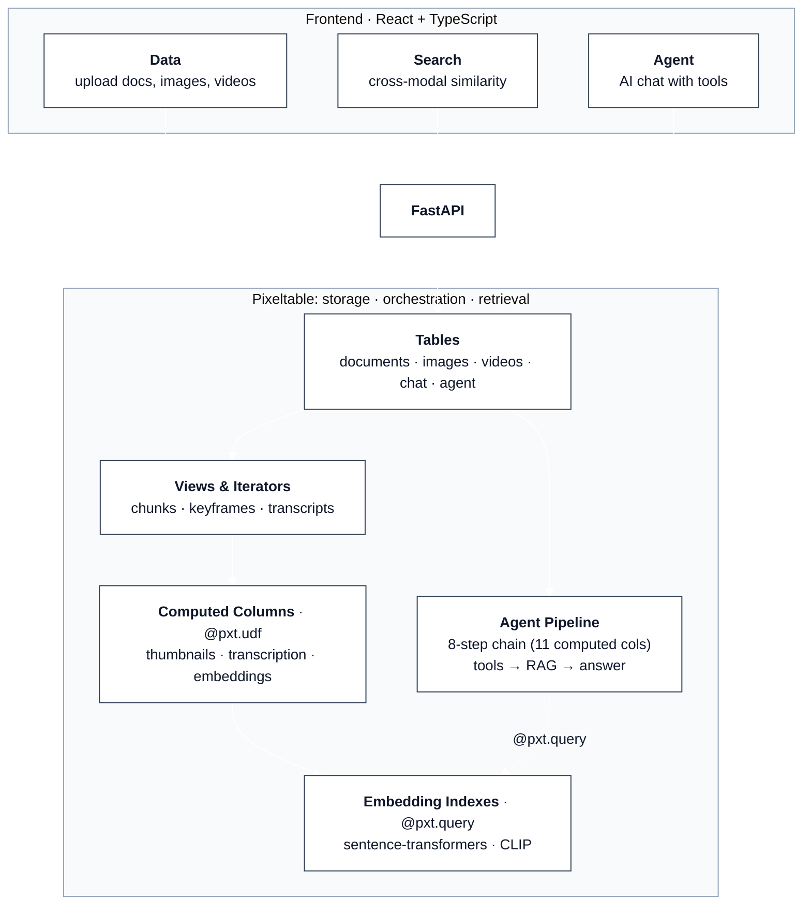
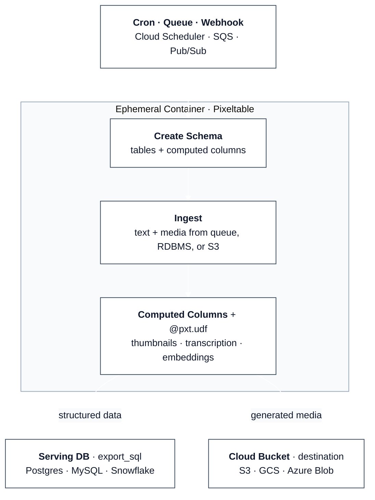
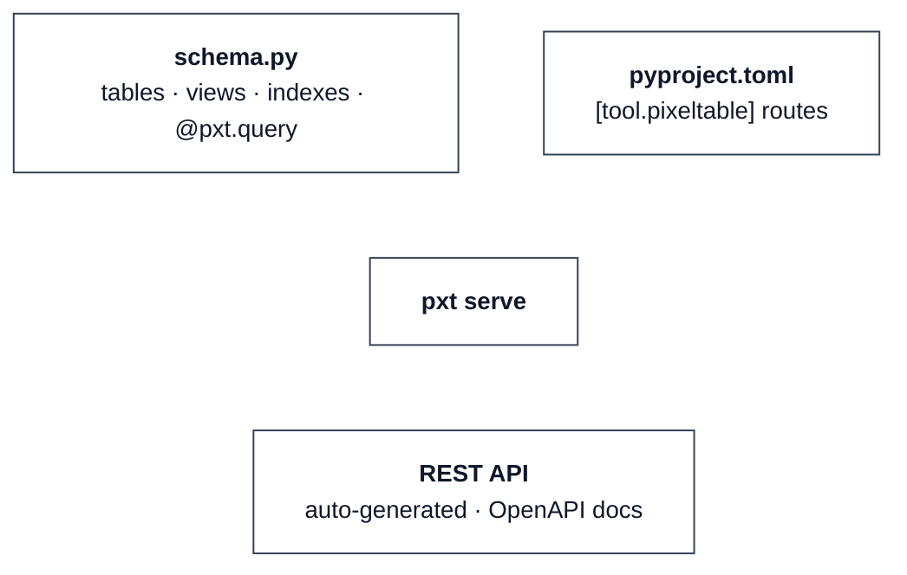

# Pixeltable Starter Kit

[Pixeltable](https://github.com/pixeltable/pixeltable) is **open-source data infrastructure for AI**. It replaces the patchwork of blob storage, metadata DBs, vector stores, media processing, orchestration, and glue code with a single declarative system. Tables, computed columns, and embedding indexes handle what typically requires stitching together S3, Postgres, Pinecone, FFmpeg, HuggingFace, Airflow, LangChain, and custom scripts to wire them all together.

## Three Patterns

This repo demonstrates three ways to use Pixeltable. Pick the one that matches your workload:

| Question | Pattern | Folder |
|---|---|---|
| I need a headless API (no frontend) | **API Backend**: FastAPI + Pixeltable | [`backend/`](backend/) |
| I need batch/background processing (cron, queue, Cloud Run Job) | **Batch Processing**: pure Python script, no HTTP server | [`batch/`](batch/) |
| I want an API with zero web code | **Declarative Serving**: `pxt serve` generates routes from TOML | [`serving/`](serving/) |

Pixeltable itself is not an HTTP framework. It's a data engine. The starter kit wraps it in FastAPI because that demo needs a web UI, but **if your workload is batch processing, you don't need FastAPI at all**. `batch/` is a plain Python script that inserts data, lets computed columns process it, exports results, and exits. Run it as a Cloud Run Job, ECS Task, Kubernetes Job, Lambda, or a cron'd container.

### Project Structure

```
# ── Pattern 1: API Backend (FastAPI, headless) ────────────────

backend/
├── main.py                    FastAPI app, CORS, router init, SPA fallback
├── setup_pixeltable.py        Schema (tables, views, indexes, agent pipeline)
├── functions.py               @pxt.udf definitions (web search, context assembly)
├── models.py                  Pydantic models (row schemas, API contract)
├── config.py                  Model IDs, system prompts, env overrides
└── routers/
    ├── data.py                Upload, list, delete, detail queries
    ├── search.py              4 similarity search endpoints
    └── agent.py               3 declarative + 1 hand-written agent query

frontend/src/
├── App.tsx                    Tab navigation (Data / Search / Agent)
├── components/                Page components + shared UI
├── lib/api.ts                 Typed fetch wrapper + client-side aggregation
└── types/index.ts             Shared TypeScript interfaces

deploy/                        Deployment configs for the full backend + frontend
├── fly/                       Fly.io (fly.toml + persistent volume)
├── render/                    Render (Blueprint render.yaml)
├── railway/                   Railway (railway.json + Dockerfile)
├── vercel/                    Vercel (frontend only, proxies /api to backend)
├── digitalocean/              DigitalOcean App Platform (app.yaml spec)
├── helm/                      Helm chart (any existing K8s cluster)
├── terraform-k8s/             Terraform + AWS EKS
├── terraform-gke/             Terraform + GCP GKE
├── terraform-aks/             Terraform + Azure AKS
└── aws-cdk/                   AWS CDK + ECS Fargate

# ── Pattern 2: Batch Processing (no HTTP server) ────────────

batch/
├── schema.py                  Tables, views, embedding indexes, computed columns
├── pipeline.py                Script: ingest → compute → export_sql → exit
├── Dockerfile                 Ephemeral container
└── deploy/                    Cloud Run Job, K8s Job/CronJob/KEDA, ECS Fargate, Lambda

# ── Pattern 3: Declarative Serving (pxt serve) ──────────────

serving/
├── schema.py                  Tables, views, indexes, @pxt.query functions
├── pyproject.toml             Dependencies + route config ([tool.pixeltable])
├── Dockerfile                 Long-running container
├── docker-compose.yml         Local testing
└── deploy/
    └── pixeltable-cloud/      Pixeltable Cloud via pxt deploy (coming soon)
```

---

## 1. API Backend

A headless FastAPI backend with Pixeltable. Demonstrates three core patterns via API endpoints: multimodal upload with automatic processing, cross-modal similarity search, and a tool-calling agent wired entirely as computed columns. The `frontend/` directory at the repo root provides a reference React UI for development, but is **not included** when scaffolding via `uvx pixeltable-new --backend`. For a full-stack app with UI, use an [application template](#application-templates) instead.



### Quick Start

**Prerequisites:** Python 3.10+, Node.js 18+, [uv](https://docs.astral.sh/uv/). Or just open in a [Dev Container](#dev-container).

```bash
git clone https://github.com/pixeltable/pixeltable-starter-kit.git
cd pixeltable-starter-kit
cp .env.example .env   # add your ANTHROPIC_API_KEY and OPENAI_API_KEY

# Backend
cd backend
uv sync                      # installs deps + spaCy en_core_web_sm
source .venv/bin/activate
python setup_pixeltable.py   # initialize schema (idempotent; set RESET_SCHEMA=true to wipe)
python main.py               # http://localhost:8000

# Frontend (new terminal)
cd frontend
npm install && npm run dev   # http://localhost:5173
```

**Production:** `cd frontend && npm run build` then `cd ../backend && python main.py`. Serves everything at `:8000`.

### Deploy

<details>
<summary><b>Docker Compose</b> (local / single server)</summary>

```bash
cp .env.example .env          # add API keys
docker compose up --build     # http://localhost:8000
```

Pixeltable data persists via named Docker volumes. Two volumes: `pixeltable-data` (catalog + blobs at `/data/pixeltable`) and `uploads` (raw files at `/app/data`). To reset: `docker compose down -v`. For production, set `PIXELTABLE_INPUT_MEDIA_DEST=s3://...` so Pixeltable owns the media.
</details>

<details>
<summary><b>Helm</b> (any existing Kubernetes cluster)</summary>

```bash
docker build -t <your-registry>/pixeltable-starter:latest .
docker push <your-registry>/pixeltable-starter:latest
helm install pixeltable-starter ./deploy/helm/pixeltable-starter \
  --set image.repository=<your-registry>/pixeltable-starter \
  --set secrets.OPENAI_API_KEY=sk-... \
  --set secrets.ANTHROPIC_API_KEY=sk-ant-...
```

**Local testing with [minikube](https://minikube.sigs.k8s.io/docs/start/):**

```bash
minikube start --cpus=4 --memory=6144
docker build -t pixeltable-starter:latest .
minikube image load pixeltable-starter:latest
helm install pixeltable-starter ./deploy/helm/pixeltable-starter \
  --set image.pullPolicy=Never --set service.type=NodePort \
  --set secrets.OPENAI_API_KEY=$OPENAI_API_KEY \
  --set secrets.ANTHROPIC_API_KEY=$ANTHROPIC_API_KEY
kubectl port-forward svc/pixeltable-starter 9000:8000
```

See [`deploy/helm/README.md`](deploy/helm/README.md).
</details>

<details>
<summary><b>Terraform</b> (provision cluster from scratch: AWS EKS / GCP GKE / Azure AKS)</summary>

```bash
cd deploy/terraform-k8s && terraform init && terraform apply   # AWS EKS
cd deploy/terraform-gke && terraform init && terraform apply   # GCP GKE
cd deploy/terraform-aks && terraform init && terraform apply   # Azure AKS
```

Each creates a managed K8s cluster with a 50Gi persistent volume. See each `deploy/terraform-*/README.md`.
</details>

<details>
<summary><b>AWS CDK</b> (ECS Fargate)</summary>

```bash
cd deploy/aws-cdk && pip install -r requirements.txt && cdk deploy
```

Serverless containers with EFS for persistent storage and ALB for load balancing.
</details>

<details>
<summary><b>Fly.io</b></summary>

```bash
cp deploy/fly/fly.toml .
fly launch --no-deploy
fly volumes create pxt_data --size 10 --region iad
fly secrets set OPENAI_API_KEY=sk-... ANTHROPIC_API_KEY=sk-ant-...
fly deploy
```

See [`deploy/fly/README.md`](deploy/fly/README.md).
</details>

<details>
<summary><b>Render</b></summary>

```bash
cp deploy/render/render.yaml .
git add render.yaml && git commit -m "add render blueprint" && git push
# Then: Render dashboard → New → Blueprint Instance → connect repo
```

See [`deploy/render/README.md`](deploy/render/README.md).
</details>

<details>
<summary><b>Railway</b></summary>

1. [railway.app/new](https://railway.app/new) → **Deploy from GitHub repo**
2. Service → **Settings** → set config path to `/deploy/railway/railway.json`
3. Set `PIXELTABLE_HOME=/data/pixeltable`, `OPENAI_API_KEY`, `ANTHROPIC_API_KEY` in Variables
4. Add a Volume mounted at `/data/pixeltable`

See [`deploy/railway/README.md`](deploy/railway/README.md).
</details>

<details>
<summary><b>DigitalOcean</b></summary>

```bash
doctl apps create --spec deploy/digitalocean/app.yaml
```

App Platform doesn't have native persistent volumes. See [`deploy/digitalocean/README.md`](deploy/digitalocean/README.md) for persistence options.
</details>

<details>
<summary><b>Vercel</b> (frontend only)</summary>

```bash
cp deploy/vercel/vercel.json frontend/
cd frontend && npx vercel --yes
# Set BACKEND_URL=https://your-backend.fly.dev in Vercel dashboard
```

Deploys the React frontend on Vercel's edge CDN with `/api` proxied to your backend. See [`deploy/vercel/README.md`](deploy/vercel/README.md).
</details>

<details>
<summary><b>Storage notes</b></summary>

All deployment options configure `PIXELTABLE_HOME=/data/pixeltable` pointing to persistent storage. For large media workloads:

```bash
PIXELTABLE_INPUT_MEDIA_DEST=s3://your-bucket/input    # or gs:// or az://
PIXELTABLE_OUTPUT_MEDIA_DEST=s3://your-bucket/output
```

See [Pixeltable Configuration](https://docs.pixeltable.com/platform/configuration.md).
</details>

---

## 2. Batch Processing

A Python script that ingests data, lets computed columns process it, exports results to a serving DB via [`export_sql`](https://docs.pixeltable.com/howto/cookbooks/data/data-export-sql), and exits. **No HTTP server, no FastAPI.** Run it as a Cloud Run Job, ECS Task, K8s Job, Lambda, or a cron'd container.



### Quick Start

```bash
cd batch
uv sync
PIXELTABLE_HOME=/tmp/pxt uv run python pipeline.py
```

### Deploy

Ready-to-use configs in [`batch/deploy/`](batch/deploy/):

| Platform | Config | Runtime | Best for |
|---|---|---|---|
| [**Cloud Run Jobs**](batch/deploy/cloud-run/) | `cloudbuild.yaml` | Up to 24h | GCP, cron/Pub/Sub triggers |
| [**Kubernetes Job**](batch/deploy/k8s-job/) | `job.yaml`, `cronjob.yaml`, `keda-scaledjob.yaml` | Unlimited | Any K8s, queue-driven scaling |
| [**ECS Fargate**](batch/deploy/ecs-fargate/) | `task-definition.json` | Unlimited | AWS, Spot pricing (~70% cheaper) |
| [**Lambda**](batch/deploy/lambda/) | `Dockerfile`, `handler.py` | Up to 15 min | Small batches, event-driven |

See [`batch/README.md`](batch/) for full details.

---

## 3. Declarative Serving

Define your schema in Python, your routes in TOML, and run `pxt serve`. Pixeltable generates a complete API with no routers, no Pydantic models, no endpoint handlers.



### Quick Start

```bash
cd serving
uv sync
uv run python schema.py                      # initialize tables
uv run pxt serve pipeline                    # http://localhost:8000/docs
```

**Coming soon: `pxt deploy`**. Same config, deployed to Pixeltable Cloud with auto-scaling and zero container management. See [`serving/deploy/pixeltable-cloud/`](serving/deploy/pixeltable-cloud/).

See [`serving/README.md`](serving/) for full details.

---

## Application Templates

Vertical apps that showcase what Pixeltable makes uniquely simple. Each builds on one of the three structural patterns above, so you already know how it works.

```bash
uvx pixeltable-new --template <name> my-app
cd my-app && uv sync && python schema.py
```

| Template | Pattern | What you get |
|----------|---------|--------------|
| [`multimodal-rag`](templates/multimodal-rag/) | serving + backend | Upload docs, images, video, audio; one unified search across all media types. `schema.py` + `app.py` + web UI |
| [`video-intel`](templates/video-intel/) | serving | Declarative video pipeline: frames, transcription, object detection, temporal search. Pure `schema.py` |
| [`agent`](templates/agent/) | serving + backend | Persistent multimodal agent with durable memory, tool calling, MCP. `schema.py` + `app.py` + web UI |
| [`audio-intel`](templates/audio-intel/) | serving + backend | Audio/podcast intelligence: transcription, diarization, summarization, semantic search. `schema.py` + `app.py` + web UI |
| [`content-pipeline`](templates/content-pipeline/) | batch | Enterprise media processing: ingest from S3, process all modalities, export to your DB. `schema.py` + `pipeline.py` |
| [`data-lab`](templates/data-lab/) | batch | ML dataset engineering: auto-annotate, curate, version, export to PyTorch. `schema.py` + `export.py` |

---

## Additional Resources

### Swapping AI Providers

This starter kit uses **Anthropic** (agent) and **OpenAI** (transcription). Embeddings run locally via HuggingFace. Pixeltable integrates with [20+ AI providers](https://docs.pixeltable.com/integrations/frameworks), including [Ollama](https://docs.pixeltable.com/howto/providers/working-with-ollama), [Gemini](https://docs.pixeltable.com/howto/providers/working-with-gemini), [Bedrock](https://docs.pixeltable.com/howto/providers/working-with-bedrock), [Groq](https://docs.pixeltable.com/howto/providers/working-with-groq), [Together](https://docs.pixeltable.com/howto/providers/working-with-together), and [more](https://docs.pixeltable.com/integrations/frameworks). To swap providers, update the computed columns in `setup_pixeltable.py`. See [LLM tool calling](https://docs.pixeltable.com/howto/cookbooks/agents/llm-tool-calling) for which providers support the agent's tool-calling pattern.

### Developing with AI Tools

Pixeltable is designed to work well with AI coding assistants. See [Building with LLMs](https://docs.pixeltable.com/overview/building-pixeltable-with-llms) for setup instructions, or jump straight to:

- **[llms.txt](https://docs.pixeltable.com/llms.txt)**: full documentation in LLM-readable format
- **[MCP Server](https://github.com/pixeltable/mcp-server-pixeltable-developer)**: interactive Pixeltable exploration (tables, queries, Python REPL)
- **[Claude Code Skill](https://github.com/pixeltable/pixeltable-skill)**: deep Pixeltable expertise for Claude
- **[AGENTS.md](AGENTS.md)**: architecture guide for AI agents working with this codebase

### Dev Container

Open this repo in [VS Code Dev Containers](https://containers.dev/), [GitHub Codespaces](https://github.com/features/codespaces), or any tool supporting the [Dev Container spec](https://containers.dev/). The `.devcontainer/` config auto-installs Python 3.12, Node 20, uv, and all dependencies. Zero local setup.

```bash
# VS Code: Cmd+Shift+P → "Dev Containers: Reopen in Container"
# GitHub Codespaces: Code → Create codespace on main
```

### Learn More

[Pixeltable Docs](https://docs.pixeltable.com/) · [GitHub](https://github.com/pixeltable/pixeltable) · [10-Minute Tour](https://docs.pixeltable.com/overview/ten-minute-tour) · [Cookbooks](https://docs.pixeltable.com/howto/cookbooks) · [AGENTS.md](AGENTS.md)

**Use cases:** [ML Data Wrangling](https://docs.pixeltable.com/use-cases/ml-data-wrangling) · [Backend for AI Apps](https://docs.pixeltable.com/use-cases/ai-applications) · [Agents & MCP](https://docs.pixeltable.com/use-cases/agents-mcp)

**Migrating from:** [DIY Pipelines](https://docs.pixeltable.com/migrate/from-diy-data-pipeline) · [RDBMS & Vector DBs](https://docs.pixeltable.com/migrate/from-rdbms-vectordbs) · [Agent Frameworks](https://docs.pixeltable.com/migrate/from-agent-frameworks)

## License

Apache 2.0
